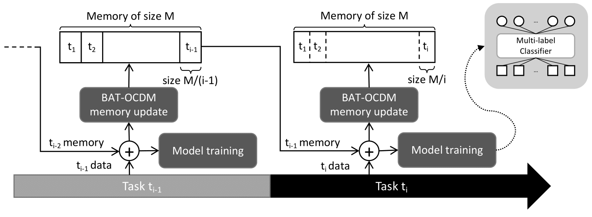
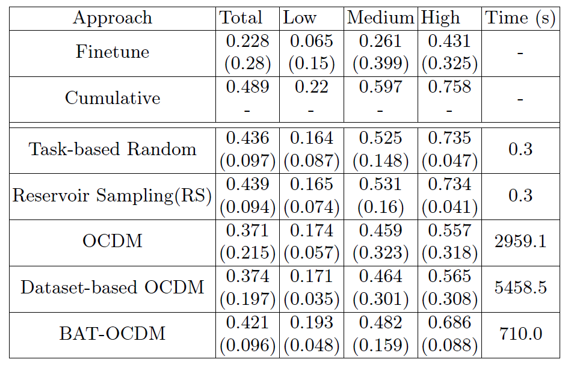

# A Multi-label Continual Learning Framework for Equipment Monitoring
<i>Davide Dalle Pezze, Denis Deronjic, Chiara Masiero, Diego Tosato, Alessandro Beghi, and Gian Antonio Susto</i>

## Abstract
<i>
Continual Learning aims to learn from a stream of tasks, being able to remember at the same time both new and old tasks.
While many approaches were proposed for single-class classification, multi-label classification in the continual scenario remains a challenging problem.
For the first time, we study multi-label classification in the Domain Incremental Learning scenario. 
Moreover, we propose an efficient approach that has a logarithmic complexity with regard to the number of tasks, and can be applied also in the Class Incremental Learning scenario.
We validate our approach on a real-world multi-label Alarm Forecasting problem from the packaging industry. 
</i>
 
 

## 1. BAT-OCDM(Balanced Among Tasks-OCDM)

Scheme of the Proposed Approach

 
 

## 2. ALARM LOGS IN PACKAGING INDUSTRY (ALPI) DATASET

We test the proposed approach on a publicly available real industrial dataset
originating from the monitoring of dairy products packaging equipment ([link]( https://ieee-dataport.org/open-access/alarm-logs-packaging-industry-alpi)) . In
the experiments, we consider the monitoring of 14 packaging machines deployed
in different plants around the world as different tasks to learn in a CL fashion.
To obtain the design matrix to train the CL-based multi-label classifier, we
draw inspiration from the paper "A Deep Learning Approach for Rare Alarms Predictions in Industrial Equipment" ([link](https://ieeexplore.ieee.org/iel7/8856/4358066/09627935.pdf)), so we consider input windows having a length of 1720 minutes, and output windows of 480 minutes.

Based on label frequencies, we split them into three groups to better assess the performance:
1. high-freq: labels {4,6,7,13}
2. medium-freq: labels {0,3,5,8,14}
3. low-freq: labels {1,2,9,10,11,12}
 
 

## 3. Results

### 3.1 Complexity of algorithms

Table with the complexity of each algorithm

More details can be found in the supplementary material([link](https://github.com/dallepezze/bat-ocdm/blob/main/Computational%20Complexity.pdf)).

### 3.2 Performance of algorithms
Table with the performance of each algorithm 
The table contains the performance for each approach. In each cell are showed
two metrics defined like in Sec. 4.1. Above is the ***Average macro f1*** $S_T$ and below the
***Average Forgetting*** $F_T$ . Based on the column, these metrics are calculated on a different
set of labels. Low, Medium, and High are label sets grouped by the frequency of the
labels, while Total consider all the labels together.

### 3.3 Speed of algorithms

 
 

